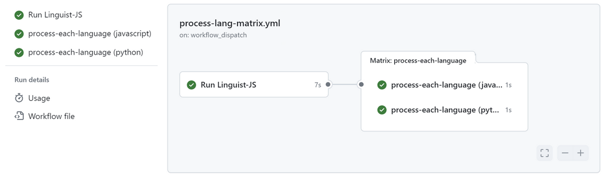

# Linguist-JS Action

Action to scan a target source directory and output a list of detected programming languages.

`npm` package [`linguist-JS`](https://www.npmjs.com/package/linguist-js) is used to detect the programming language name(s) at a given source path.

## Inputs

| Name               | Description                  |
| ------------------ | ---------------------------- |
| `source_root_path` | `Source code directory/path` |

## Outputs

| Name              | Description                                                    |
| ----------------- | -------------------------------------------------------------- |
| `languages`       | `JSON formatted array of languages detected`                   |
| `linguist_result` | `JSON formatted output, as returned from linguist-js analysis` |

## Usage

### Example 1: Detect Languages

To run the action against the `src` folder in a repository with the following details:

- `Name`: `https://github.com/my-git-user/my-github-repository`

- `Branch`: `dev`

- Contents:

  ```bash
  .
  ...
  ...
  └── README.md
  └── src
      ├── my-javascript.js
      └── my-python.py
  ```

- Sample workflow

  ```yaml
  on:
    push:
      branches:
        - dev

  jobs:
    run-linguist:
      runs-on: self-hosted
      name: Run Linguist-JS
      steps:
        - name: Checkout
          uses: actions/checkout@v4

        - name: Detect languages at source path ./src
          uses: tonys-code-base/linguist-action@master
          id: analyze
          with:
            source_root_path: ./src

        - name: List the languages detected
          id: list-langs
          run: |
            echo ${{ steps.analyze.outputs.languages }}

        - name: List full output from linguist-js analysis
          id: list-linguist-result
          run: |
            echo ${{ steps.analyze.outputs.linguist_result }}
  ```

  Sample output from steps:

  - id: `list-langs`
    ```json
    { "languages": ["javascript", "python"] }
    ```
  - id: `list-linguist-result`
    ```json
    {
      "count": 2,
      "bytes": 1278,
      "results": {
        "JavaScript": {
          "type": "programming",
          "bytes": 1252,
          "color": "#f1e05a"
        },
        "Python": { "type": "programming", "bytes": 26, "color": "#3572A5" }
      }
    }
    ```

### Example 2: Generate a Matrix Language List for Concurrent Execution

The following sample workflow contains two jobs:

- **run-linguist**: Detects languages and outputs as a `matrix` array, which is passed to the next job
- **process-each-language**: Automatically creates a job per `matrix` element/language

  ```yaml
  on:
    push:
      branches:
        - dev

  jobs:
    run-linguist:
      runs-on: self-hosted
      outputs:
        matrix: ${{ steps.set-matrix.outputs.matrix }}
      name: Run Linguist-JS
      steps:
        - name: Checkout
          uses: actions/checkout@v4

        - name: Detect languages at source path ./src
          uses: tonys-code-base/linguist-action@master
          id: analyze
          with:
            source_root_path: ./src

        - name: Generate matrix
          id: set-matrix
          run: |
            echo "matrix=$(echo ${{ steps.analyze.outputs.languages }} | jq -c '.languages')" >> $GITHUB_OUTPUT

    process-each-language:
      runs-on: self-hosted
      needs: run-linguist
      # Do something for each language detected.
      # For example, perform codeql analysis for each language in parallel
      strategy:
        matrix:
          language: ${{ fromJson(needs.run-linguist.outputs.matrix) }}
      steps:
        - run: |
            echo ${{ matrix.language }}
  ```

Output:


